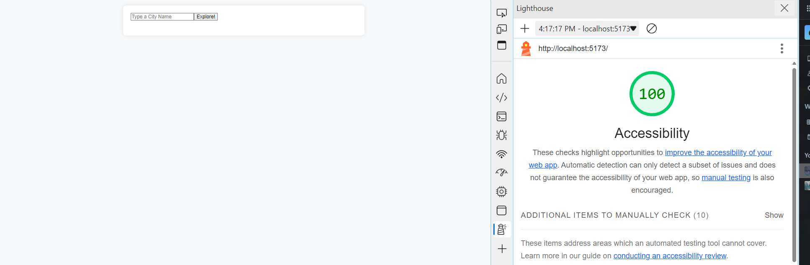

# React + Vite

This template provides a minimal setup to get React working in Vite with HMR and some ESLint rules.

Currently, two official plugins are available:

- [@vitejs/plugin-react](https://github.com/vitejs/vite-plugin-react/blob/main/packages/plugin-react/README.md) uses [Babel](https://babeljs.io/) for Fast Refresh
- [@vitejs/plugin-react-swc](https://github.com/vitejs/vite-plugin-react-swc) uses [SWC](https://swc.rs/) for Fast Refresh
# city-explorer-api

4/1 lab6
# Project Name

**Author**: Qilin Xie
**Version**: 1.0.0 (increment the patch/fix version number if you make more commits past your first submission)

## Overview
Display map information at the city the user inputs

## Getting Started
Use API to create a backend server to be able to receive requests from user. 

## Architecture
Use axios, JS for the backend serice and jJS, react + vite for the front end

## Change Log
<!-- Use this area to document the iterative changes made to your application as each feature is successfully implemented. Use time stamps. Here's an example:

01-01-2001 4:59pm - Application now has a fully-functional express server, with a GET route for the location resource. -->
1:20pm 4/1, edited components and .env.local, app,js; ACP to deploy to netlify for first commit

## Credit and Collaborations
ChatGPT helped me with this lab

1. Name of feature: Locations

Estimate of time needed to complete: _30 mins____

Start time: __12:50___

Finish time: _1:15pm____

Actual time needed to complete: __25mins___

2. Name of feature: map

Estimate of time needed to complete: __30 mins___

Start time:  :1:15_____

Finish time: __2___

Actual time needed to complete: _45 mins___

3.Name of feature: erros

Estimate of time needed to complete: __30 mins___

Start time: _1:40____

Finish time: __2:20___

Actual time needed to complete: ___40 mins__

Accessibility score: 

hello